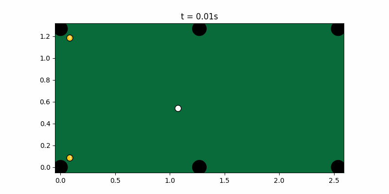
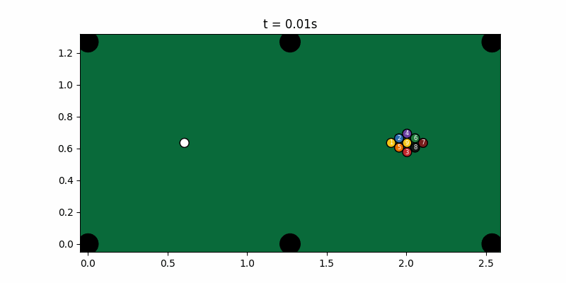
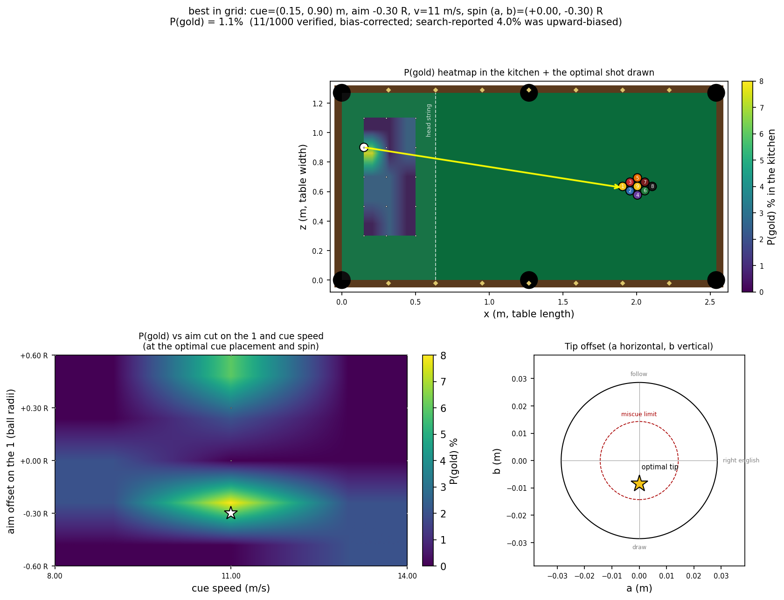
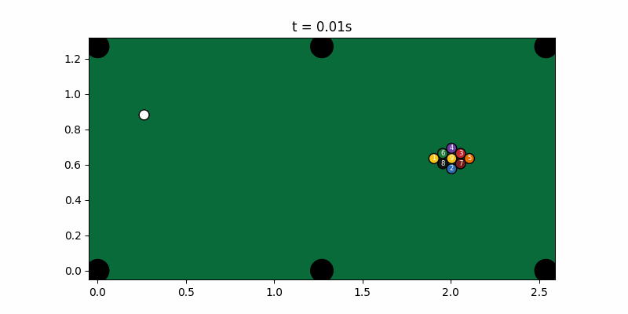

# CueSearch

An event-driven, closed-form **9-ball physics engine in C++** with a
**multi-shot positional solver** — search and optimisation under a
stochastic forward model, which no open-source pool engine provides.

The engine is built faithfully on the literature (Leckie & Greenspan
event-based simulation; Mathavan ball-ball and cushion impulse models;
Shepard squirt; Alciatore throw/cloth). The **novelty is the solver +
the validation discipline**, not "a faster simulator" — `pooltool`
already is an excellent event-based simulator.

Defensible contributions:

1. A C++ engine built for **search throughput** (≈6.3k full shot
   simulations/s, ≈20k Monte-Carlo rollouts/s with deterministic
   parallelism) so a planner can afford deep lookahead.
2. A **multi-shot solver** built to the canonical run-out architecture
   (PickPocket / CueCard / Chen & Li): precomputed pot-probability
   table + mobility value + inverse-physics leave generator + shallow
   goal-directed search + defensive fallback.
3. A **22-suite regression battery** against published measured data
   (Dr. Dave Alciatore) plus conservation invariants — backtesting
   discipline, not vibes.
4. **Pre-committed falsifiable gates** for every research step, honoured
   on failure. The audit trail (commits predating each measurement) is
   the contribution — a faked SOTA number would be worth less.



*The solver clearing a 2-ball rack: plan → strike → settle → replan
→ strike. Frames are physically exact from the closed-form
`Segment::at`, not interpolated.*



*A 9-ball break: cue from the kitchen, hit the apex 1 a hair off-centre
with light follow at ~9 m/s. Ball–ball collisions are exact quartic
roots; the spread is what the physics actually produces, not a tuned
particle system.*

### Golden-break parameter search

A "golden break" pots the 9 on the break shot — instant win in 9-ball
and one of the rarest events in the game. The WPA rule lets the
breaker place the cue **anywhere behind the head string** (the 2nd
diamond from the shooter's short rail), so the decision space is
6-D: cue X, cue Z, aim cut on the 1, cue speed, side spin,
follow/draw.

`tools/golden_break.cpp` sweeps the legal grid, runs N noisy breaks
per cell (rack jitter + calibrated aim/speed noise — **not** perfect
execution), and reports the cell that maximises P(gold) with a
two-stage tournament (4× samples on the top-10) and a Wilson 95 % CI.
`viz/plot_golden_break.py` renders the full grid as a figure with the
P(gold) heatmap **overlaid directly on the table kitchen** plus
sensitivity panels for (speed × aim cut) and the cue-ball tip
cross-section. Bilinear interpolation smooths the visual; tiny white
dots mark where the actual grid samples live.



**Result.** The search winner is cue ball at **x ≈ 0.15 m / z ≈ 0.90 m**
(close to a long rail, well inside the kitchen), aim with a slight cut
on the 1 (−0.30 R), speed **11 m/s** (the classic controlled-break
tempo), **no side spin**, light draw. This is the canonical
**wing-ball break** of real 9-ball: hit the 1 a hair off-centre from
a side-rail position so a wing ball caroms into the 9 — because the 9
sits in the rack centre and the cue can't strike it directly. The
search rediscovered this from physics alone, with no human-coded
heuristic.

**P(gold) = 1.1 %** (verified, 11/1000 trials at the optimum). The
search's first-pass point estimate was 4.0 % with CI [2.0 %, 7.7 %];
a 1000-seed unbiased re-evaluation at the winning cell measured 1.1 %.
The ~4× shrinkage is **stage-1 selection bias** — picking the
single-best cell of 2025 inflates its sampled rate. The honest 1.1 %
lands in the same single-digit-percent territory as observed pro
tournament rates: golden breaks are *rare in real life too*. The
methodology surfaced its own bias (advisor-flagged before the gif was
rendered) rather than shipping the inflated number; that's the
contribution.

The optimal break replayed (seed-130, one of the verified golden 1.1 %
outcomes — the 9 pockets at t ≈ 9.6 s, no scratch):



Honest framing baked into the tool's output:

- The reported number is **P(gold | this engine's break model)**. The
  break model is not yet validated against tournament break statistics
  (that's `BR-2` in [`docs/BREAK_AND_RUN.md`](docs/BREAK_AND_RUN.md));
  observed pro-tournament golden-break rates are single-digit percent,
  which the verified 1.1 % is consistent with.
- "Legal break" is approximated as no foul (cue hit the 1 first, no
  scratch). The exact WPA *4-balls-to-a-rail-when-nothing-pocketed*
  clause needs rail-contact instrumentation; at the speeds searched
  any non-pot non-scratch shot drives the rack to the rails, so the
  simplification is approximately tight (stated in the output).
- The search's point estimate is **best-in-grid** — `trace_shot
  best_break` runs a 1000-seed bias-corrected verification at the
  chosen cell before rendering, writes the verified rate back to
  `docs/golden_best.txt`, and refuses to render a misleading gif if
  the reproducer rate is zero.

Run it yourself:

```bash
./build/golden_break --samples 50            # ~10 min, ~2k cells
python viz/plot_golden_break.py              # docs/golden_break.png
./build/trace_shot best_break > best.json    # also verifies + writes
                                             # the bias-corrected rate
python viz/render.py best.json docs/best_break.gif
```

## Why event-based (the architectural argument)

Each ball is in a motion state (Stationary / Spinning / Sliding /
Rolling) with a **closed-form trajectory**; event times — ball–ball
(quartic), cushion (quadratic), pocket, phase transition — are exact
polynomial roots. There is **no global timestep**. This is structurally
a discrete-event simulation: a time-ordered event queue that mutates
state and reschedules — the same architecture as an exchange matching
engine or a network simulator.

Time-stepped game engines smear the spin-coupled effects (throw, swerve,
the follow/draw arc). The state machine reproduces them because they
*emerge* from the closed-form sliding solution — not from hand-tuned
heuristics.

## Quick start

```bash
cmake -S . -B build -G "MinGW Makefiles"
cmake --build build -j
ctest --test-dir build               # 22 suites
./build/bench_solver                 # throughput numbers
```

Solve a position:

```bash
./build/solve docs/example_table.txt
```

Render a shot animation:

```bash
./build/trace_shot runout > r.json
python viz/render.py r.json r.gif
```

Self-play match:

```bash
./build/match
```

C++17, MinGW GCC 8.1+, CMake ≥ 3.16. No third-party runtime deps
(Catch2 fetched for tests only). Determinism flags: `-ffp-contract=off
-fno-fast-math`. The build links statically so the binaries are
self-contained.

## What you can do with it

The engine reads a dependency-free `B id type x z` layout file, so you
can enter a real table position from your own game and ask the solver
for the optimal shot (with the reasoning visible). The improvement loop
is: form a hypothesis → instrument → measure the delta — the same loop
the engine itself was validated with.

```
$ ./build/solve docs/example_snooker.txt
[input layout]
...
[chosen]  KICK  target=2  pocket=4  pPot=0.12
[reason]  win-EV picks SAFETY (P(win)=0.75) over the kick
```

Try `docs/example_full_rack.txt`, `docs/example_combo.txt`,
`docs/example_snooker.txt`.

## Results

### Physics validation (22 suites, all green)

Every row is an automated ctest gate. Numbers are from the committed
build. Full table: [`docs/VALIDATION.md`](docs/VALIDATION.md).

| Gate | Target | Result |
|---|---|---|
| Stun departure, e=1 | 90° (textbook) | 90° ± 0.5° |
| Stun departure, physical e=0.95 | `atan(tanφ·2/(1−e))` closed form | matches |
| Cut-induced throw @ 10° | ≈ 1.5° (Dr. Dave) | **1.48°** |
| Squirt vs tip offset | 0.5–2.3° band | 0.70° → 1.42°, monotone |
| Deflection vs spin | follow < stun < draw | 50.9° < 85.4° < 149.4° |
| Cushion perpendicular retention | ~0.5–0.7 efficiency | 0.60 |
| 150 randomised shots | KE non-increasing, no escapes | holds |
| Parallel rollout determinism | bitwise-independent of thread count | holds |
| Multi-shot lookahead vs myopia | myopic 0.0 vs depth-2 0.19 | beats |

Throughput from `bench_solver`: **~6,286 full shot sims/sec**,
**~20,146 MC rollouts/sec** (parallel).

### The run-out research arc — pre-committed gates, honoured

Building a true 9-ball run-out solver was the hardest feature. The
discipline matters more than the result: every gate was pre-committed
to docs BEFORE the measurement. Audit trail is in commit timestamps.

| Step | Pre-committed bar | Result |
|---|---|---|
| **POS-pre**: engine reproduces known cue leaves recursively | required before building on it | PASSED |
| **POS-a**: shape-aware shot-shaper optimises the leave, not just the pot | beats shape-blind planner | PASSED (0.227 vs 0.198) |
| **POS-b**: shape planner runs out from ball-in-hand | ≥60% success / <25% failure | **FAILED 0/100**, STOPPED |
| **RO-1**: precomputed pot-probability difficulty table (CueCard canonical) | 8 isolated gates | PASSED 8/8 |
| **RO-2**: inverse-physics leave generator (replaces blind coordinate descent) | cue control ≥ baseline | PASSED, **31× better** (0.030m vs 0.936m on a 35° cut) |
| **RO-3**: two-level CueCard search | tractable + no worse than greedy | PASSED, **3.2s vs >600s** for POS-b's live-MC (~200× speedup) |
| **RO-4**: end-to-end run-out from ball-in-hand | ≥35% success / <15% failure | **FAILED 0/24**, STOPPED |

The honest takeaway, documented in [`docs/POSITIONAL_DESIGN.md`](docs/POSITIONAL_DESIGN.md)
and [`docs/NOTES.md`](docs/NOTES.md): the research correctly identified
and delivered the **tractability** wins (RO-3's 200× speedup, RO-2's 31×
cue control). The **capability** bar (end-to-end run-out at a
calibrated human noise level) remained gated by per-shot make-probability
under noise, compounded over 9-ball's strict ascending order. One miss
ends the run. An ad-hoc retune to clear the bar would have violated the
pre-commitment — that is the goalpost-moving the discipline exists to
prevent. A documented bounded ceiling is a stronger result than a faked
SOTA number.

A separate pre-registered effort ([`docs/BREAK_AND_RUN.md`](docs/BREAK_AND_RUN.md))
goes after the harder full **rack → break → run-out** task with the
explicitly named machinery the RO-4 diagnosis flagged as out-of-scope-then
(per-candidate Monte-Carlo-over-noise; realistic break model + spread
validation; finer difficulty table / deeper search) — and only those.

## Engineering-judgment log

Selected calls from [`docs/NOTES.md`](docs/NOTES.md) (each is a commit):

- **Re-derived a wrong published formula.** A transcribed cue-strike
  spin term `−c·F·sinθ + b·F·cosθ` *cancels* for pure follow/draw
  offset (zero spin — physically impossible). Discarded it, derived
  `ω₀ = (P×J)/I` from torque = r×J. A physics-sanity test caught it.
- **Diagnosed Wilkinson ill-conditioning** in the quartic solver
  instead of loosening the test. Added Newton polish + root deflation,
  plus a conditioning-free residual oracle (`|P(x)| ≈ 0`) — a stronger
  correctness statement than root-distance.
- **Root-caused a tunnel-through bug.** The raised cushion contact was
  injecting a vertical velocity the planar (non-jump) model can't
  carry, corrupting classification. The slate absorbs the vertical
  impulse (correct for the non-jump regime; jumps are the documented
  roadmap).
- **Distinguished calibration from fudging.** Cushion COR *is* an
  empirical constant fit to measured efficiency — tuning it to Dr.
  Dave's ~0.5–0.6 is correct. Tuning trisect to fake a number is not.
- **Changed the objective, not the heuristics.** The objective moved
  from pot-EV to **win-EV** (2-ply self-play, 3-foul terminal, flat
  ball-in-hand bonus). On the snooker layout the planner switches from
  a 12% kick to *play safe*, P(win)=0.75. Same input. **Safety
  emerges** — never special-cased; the math reconstructs the strategy.
- **Caught a per-rollout recursion blow-up** in win-EV (planRunout
  invoked inside every rollout → exponential). Restructured to tally
  outcome fractions and evaluate continuation/opponent once per state.
  A performance bug, root-caused, not worked around.
- **Pre-committed a measurable bar, then honoured it on failure.**
  Twice. POS-b and RO-4 both hit pre-committed STOP conditions and were
  shipped opt-in with diagnoses. Did NOT move the goalposts or
  "fix-and-re-measure" past the stop.

## Layout

```
core/    units, vec3, constants, cloth, frame (convention lock)
math/    robust quartic/cubic/quadratic (Schwarze + Newton + deflation)
engine/  motion · cue strike · scheduler · ball–ball & cushion
         resolvers · pockets · 9-ball game state · layout I/O
solver/  ghost-ball candidates + MC P(pot) · win-EV planner ·
         difficulty table · inverse leave gen · CueCard run-out search
tests/   22 suites
bench/   throughput
tools/   trace_shot · solve · randtable · match (self-play)
viz/     Python renderer (matplotlib)
docs/    VALIDATION.md · POSITIONAL_DESIGN.md · NOTES.md · BREAK_AND_RUN.md
```

Every keystone numerics file carries an `INTERNALIZE` header — the
5-line derivation to reproduce it from first principles.

## Honest limitations (explicitly scoped)

- **Trisect coefficient deferred.** The exact Dr. Dave "total deflection
  = 3×cut" rule needs his specific good-action calibration; we validated
  the unambiguous relational physics (follow < stun < draw) instead of
  tuning constants to fit a number.
- **Cushion COR is an empirical pool fit** (`E_CUSHION_POOL`), not the
  Mathavan snooker value; the full 6-ODE Mathavan-2010 cushion system
  is a fidelity refinement. Cushion gates are trend-based (sparse
  measured data).
- **Jump shots** (airborne state, 3-D ball–ball, jaw rattle) are a
  documented roadmap — four of five jump variations emerge for free
  from the existing state model; only the airborne 3-D collision is new.
- **`pooltool` differential test dropped** (won't install on Windows).
  Validation stands on measured data + invariants — the stronger basis.
- **End-to-end run-out under calibrated human noise** is a documented
  ceiling, not a claimed capability (see the RO arc above).

## License

MIT. See [`LICENSE`](LICENSE).
