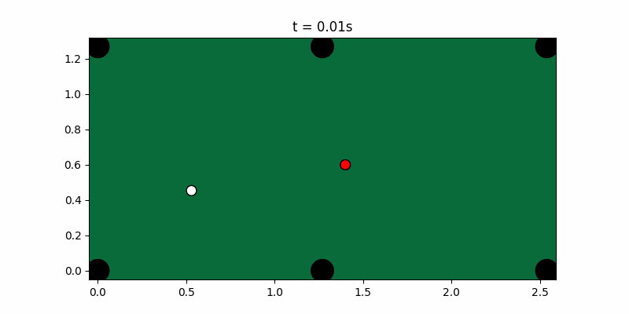

# CueSearch

An event-driven, closed-form billiards physics engine in C++ with a
**multi-shot positional-lookahead solver** — search/optimisation over a
stochastic forward model, which no open-source pool engine provides.

The engine is substrate built faithfully on the literature (Leckie &
Greenspan event-based simulation; Mathavan ball-ball & cushion impulse
models; Shepard squirt; Alciatore throw/cloth). The **novelty is the
solver + the validation discipline**, not "a faster simulator" —
`pooltool` already is an excellent event-based simulator. CueSearch's
defensible contributions:

1. A C++ engine built for **search throughput** (≈6.3k shots/s, ≈20k
   parallel rollouts/s) so a planner can afford deep lookahead.
2. A **multi-shot solver** (beam search over leave positions, value =
   `P(legal pot) · E[continuation]`) — provably changes the decision:
   on a positional rack the myopic planner leaves **0%** on the next
   ball, the depth-2 planner **19%**.
3. A **regression suite vs published measured data** (Dr. Dave) plus
   conservation invariants — backtesting discipline, not vibes.

  

*Left: the solver running out a 2-ball rack. Right: a post-collision
follow arc (curve then straighten) — frames are physically exact
(closed-form `Segment::at`), not interpolated.*

## Why event-based (the architectural argument)

Each ball is in a motion state (Stationary / Spinning / Sliding /
Rolling) with a **closed-form trajectory**; event times (ball-ball =
quartic, cushion = quadratic, pocket, phase transition) are exact
polynomial roots — **no global timestep**. This is structurally a
discrete-event simulation: a time-ordered event queue that mutates state
and reschedules — the same architecture as an exchange matching engine.
Time-stepped game engines smear the spin-coupled effects (throw, swerve,
the follow/draw arc); the state machine reproduces them because they
*emerge* from the closed-form sliding solution.

## Build

```
cmake -S . -B build -G "MinGW Makefiles"
cmake --build build -j
ctest --test-dir build            # 11 suites
./build/bench_solver              # throughput numbers
./build/trace_shot runout > r.json && python viz/render.py r.json r.gif
```

C++17, no third-party runtime deps (Catch2 fetched for tests only).

## Layout

`core/` units, vec3, constants, cloth, frame (convention lock) ·
`math/` robust quartic/cubic/quadratic (Schwarze + Newton + deflation) ·
`engine/` motion · cue strike · scheduler · ball-ball & cushion
resolvers · pockets · 9-ball game state · layout I/O ·
`solver/` ghost-ball candidates + MC P(pot) · multi-shot planner ·
`tests/` 11 suites · `bench/` · `tools/` trace · `viz/` renderer ·
`docs/VALIDATION.md` the gate table.

Every keystone numerics file carries an `INTERNALIZE` header — the 5-line
derivation to reproduce it from first principles.

## The improvement loop

`engine/layout` reads a dependency-free `B id type x z` file, so you can
enter a real table position from your own game and ask the solver for the
optimal shot + why. Form a hypothesis → instrument → measure the delta:
the same loop the engine itself was validated with.

## Status & honesty

Validated against measured data + invariants (see
[docs/VALIDATION.md](docs/VALIDATION.md)). Explicitly scoped, not faked:
trisect coefficient deferred (relational physics validated instead);
cushion COR is an empirical pool fit; jump shots are a documented
roadmap (4 of 5 variations emerge for free from the state model);
pooltool differential test dropped (Windows install conflict).
